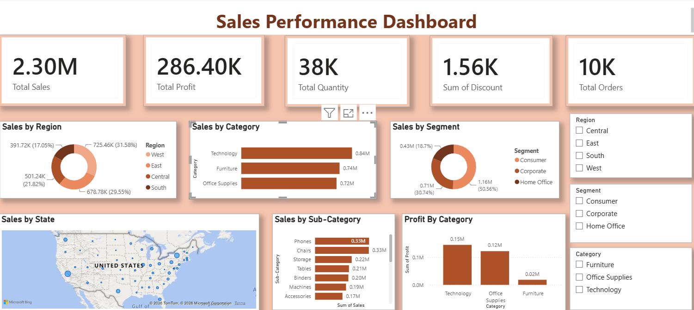

# Sales Performance Dashboard

## Overview
An interactive Power BI dashboard built using the Superstore dataset to analyze sales performance.

## Screenshot

## KPIs
- Total Sales
- Total Profit
- Total Quantity
- Total Orders
- Total Discount

## Dashboard Features
- Sales by Region
- Sales by Category
- Sales by Sub-Category
- Sales by Segment
- Sales by State (Map)
- Interactive slicers for Region, Segment, and Category

## Tools Used
- Power BI
- Power Query
- DAX
- Microsoft Excel

## Skills Demonstrated
- Data Cleaning
- Data Modeling
- Dashboard Design
- Business Intelligence
- Data Visualization
